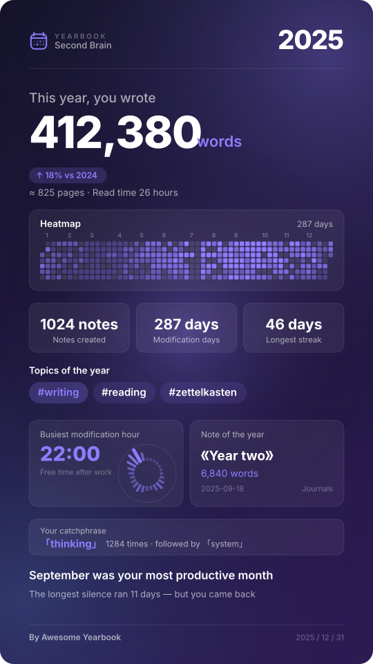
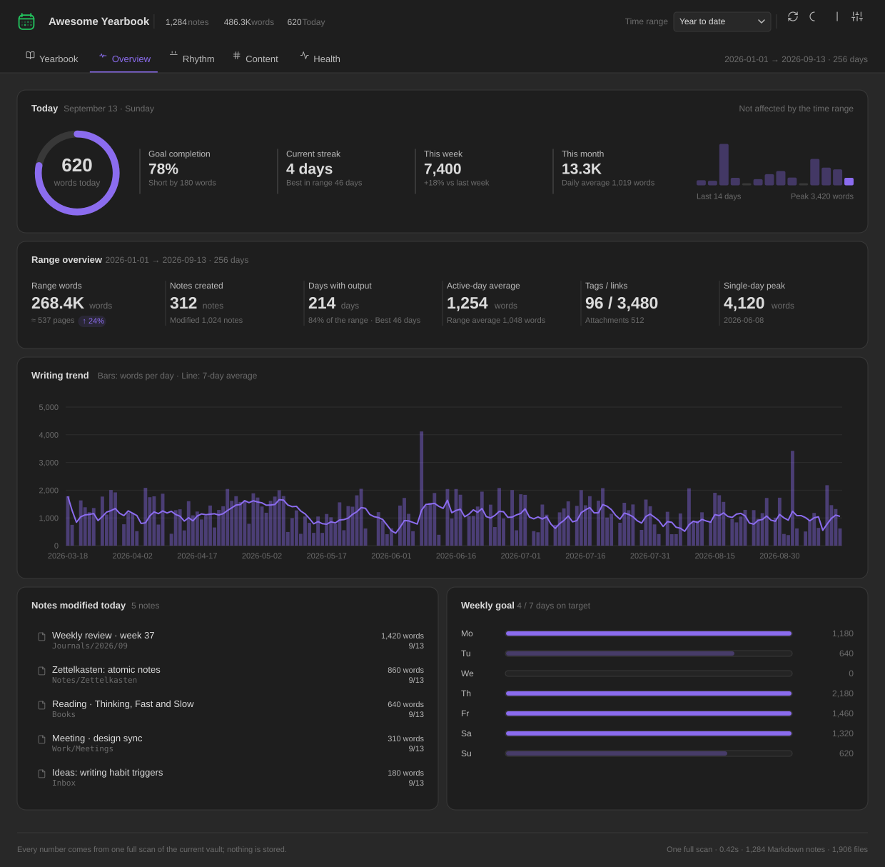

<div align="center">

# 📖 Awesome Yearbook

### Writing statistics, year in review & vault analytics for [Obsidian](https://obsidian.md)

**Turn your vault into a yearbook.** Word counts, writing heatmaps, streaks, tag trends, vault health — and a one-tap, share-ready *Year in Review* card. 100% local, zero telemetry.

[](https://obsidian.md/plugins?id=awesome-yearbook)
[](https://github.com/AwesomeDog/obsidian-awesome-yearbook/releases/latest)
[](LICENSE)
[](https://github.com/AwesomeDog/obsidian-awesome-yearbook/stargazers)

[Install](#-installation) · [Features](#-features) · [Share Card](#-share-card-your-year-in-review) · [How it works](#-how-it-works) · [FAQ](#-faq)

</div>

---

## ✨ What is Awesome Yearbook?

**Awesome Yearbook** is an all-in-one **writing statistics and vault analytics dashboard** for Obsidian. It answers the questions every note-taker eventually asks:

> *How much did I actually write this year? When am I most productive? What do I keep writing about? Is my second brain healthy — or just hoarding?*

One full vault scan gives you **five dashboards** — Yearbook, Overview, Rhythm, Content and Health — plus a beautiful **shareable "Wrapped"-style year-in-review image** you can post anywhere.

Think of it as *Spotify Wrapped + GitHub contribution graph + a writing tracker*, built natively for your Obsidian vault.

<div align="center">





</div>

---

## 🚀 Features

### 📖 Yearbook — your writing year, in one page

- **Year headline**: *“This year, you wrote **412,380** words”* — with a plain-language translation (*≈ an 825-page book · 11 hours to read aloud*).
- **Year switcher** with year-over-year (YoY) comparison badges.
- **Key stats**: new notes, days written, longest streak, average words per active day, top month, same period last year.
- **Monthly output chart**: this year as bars, last year as a dashed line.
- **Cumulative vs. last year**: are you ahead of or behind last year’s pace?
- **Themes of the year**: your most-written tags, ranked.
- **Top notes of the year**: your longest, most substantial pieces.
- **Moments timeline**: first note of the year, most productive day, longest streak, longest silence — *the story hidden in your data*.

### 📈 Overview — today, this week, this month

- **Daily word goal ring** with progress %, remaining words and streak.
- **14-day sparkline** with peak markers.
- **Range overview**: words, new notes, active days, daily average, tags & backlinks, single-day peak.
- **Writing trend chart**: daily bars + 7-day moving average.
- **Notes edited today**, one click away from opening them.
- **Weekly goal meters**: which days hit target, which didn’t.

### 🗓️ Rhythm — when you write

- **Writing heatmap** — a GitHub-style contribution calendar for your vault.
- **Punch card**: weekday × hour bubble chart of your writing sessions.
- **24-hour clock**: polar chart of when the words actually happen.
- **Monthly output** & **cumulative current word count** (attributed by last modification date).
- **Rhythm summary**: current streak, longest streak, longest gap, most active weekday, golden hour, **night-owl index** (22:00–05:00 share).

### 🏷️ Content — what you write about

- **Top tags** ranked by note count and word count.
- **Folder treemap** — area = current note words, instantly showing where your notes are concentrated.
- **Note length histogram** (<200 / 200–500 / 500–1k / 1k–2k / 2k–5k / 5k+).
- **Vault file composition** donut: Markdown, PNG, JPG, PDF, Canvas, audio…
- **Frequent words** ranked bar chart, stop-words removed — find your verbal tics.
- **Most-linked notes (hubs)** and **longest notes** in range.

### 🩺 Health — is your second brain tidy?

- **Vault health score (0–100)** with a radar breakdown across connectivity, tagging, freshness, completeness and link integrity.
- **Actionable issue lists**: orphan notes, untagged notes, broken links, stale notes, stub/fragment notes, unfinished tasks, unused attachments.
- **Cleanup advice**, sorted by effort-to-impact — not generic tips, but numbers from *your* vault.

### 🔍 Inspector — charts are entry points, not decoration

Click **any** bar, cell, bubble, tag or treemap block → the side inspector lists the exact notes behind that number. Click a note → it opens in Obsidian. No dead ends.

---

## 🎨 Share Card: your Year in Review

A pure-Canvas, **@2x high-resolution** image generator built for social media.

| | |
|---|---|
| **Aspect ratios** | `9:16` Stories · `4:5` Feed · `1:1` Square |
| **Palettes** | Midnight · Rice Paper · Forest · Ember (decoupled from your UI theme) |
| **Modules** | Header, hero number, full-year heatmap, stat cards, top-3 tags, golden hour + star note, catchphrase, closing line — **toggle any of them off** |
| **Smart layout engine** | Disabled modules give their space back; spacing is re-balanced automatically for every ratio |
| **Export** | ⬇️ Download PNG · 📋 Copy image to clipboard · 📝 Copy matching caption text |

The auto-generated caption is ready to paste:

> *In 2025, I wrote 412,380 words in my vault — about an 825-page book.*
> *1,024 notes, 287 days with a trace, longest streak 46 days.*
> *Golden hour: 22:00. September was my most productive month.*
> *Most-written topics: #writing #reading #zettelkasten*

---

## 📦 Installation

### From the Obsidian Community Plugins (recommended)

1. Open **Settings → Community plugins** and make sure *Restricted mode* is **off**.
2. Click **Browse**, search for **“Awesome Yearbook”**.
3. Click **Install**, then **Enable**.
4. Click the 📖 ribbon icon, or run **`Awesome Yearbook: Open yearbook`** from the Command Palette (`Ctrl/Cmd + P`).

---

## 🧠 How it works

- **One full scan, everything derived.** Opening the view — or clicking **Rescan** — reads every Markdown file once: word count, created and modified timestamps, tags, links, tasks and attachments. All five dashboards are computed from that single snapshot.
- **Nothing is stored.** No history, no cache, no background indexing. Close the view and the snapshot is gone; reopening it runs a fresh scan. The plugin never writes to your vault, not even to its own `data.json`.
- **Attributed by last modification date.** A single scan cannot recover how many words you *added* on a given day, so daily output attributes each note’s current word count to the day it was last modified. `Σ daily = Σ notes`, so the numbers on different tabs always agree — and the UI labels them as “by last modification date” rather than pretending otherwise.
- **Charts are bundled locally** — the dashboard works completely offline, and the share card is drawn on a raw `<canvas>` with no external dependency at all.

---

## 🔒 Privacy

- ✅ **No network requests.** Nothing leaves your device — ever.
- ✅ **No telemetry, no analytics, no account.**
- ✅ **Read-only.** Awesome Yearbook never modifies, moves or deletes your notes.
- ✅ Share cards are generated **on your machine**; you decide what to export.

---

## 💻 Compatibility

- Obsidian **v1.13.7+** (the `minAppVersion` declared in `manifest.json`)
- ✅ Desktop: Windows · macOS · Linux
- ✅ Mobile: iOS · Android — responsive, single-column layout
- ✅ Follows the Obsidian light/dark theme; the accent color is chosen inside the plugin
- ✅ No dependency on Dataview, Templater or any other plugin

---

## ❓ FAQ

<details>
<summary><b>Does it change my notes in any way?</b></summary>

No. The plugin only reads file metadata and content. It never writes to your Markdown files.
</details>

<details>
<summary><b>Does it count code blocks, front matter and links?</b></summary>

Yes — word counts are taken from the raw note text, so front matter, code fences and link syntax are all included. There is no setting to exclude them.
</details>

<details>
<summary><b>Where does the historical data come from if I just installed it?</b></summary>

From your vault itself. Created/modified timestamps and current word counts provide an attributed view of the past; daily output is assigned to the note's last modification date.
</details>

<details>
<summary><b>Does it work on mobile?</b></summary>

Yes. All five dashboards are responsive, and PNG export / clipboard copy work on both iOS and Android.
</details>

---

## 🗺️ Roadmap

- [ ] Monthly & weekly recap cards
- [ ] Per-folder and per-tag writing goals
- [ ] Export stats to CSV / JSON, and a Dataview-friendly API
- [ ] Multi-year comparison view

Have an idea? [Open a feature request](https://github.com/AwesomeDog/obsidian-awesome-yearbook/issues/new).

---

## 🤝 Contributing

Pull requests are welcome!

```bash
git clone https://github.com/AwesomeDog/obsidian-awesome-yearbook.git
cd obsidian-awesome-yearbook
npm install
npm run dev       # watch build -> main.js
npm run build     # typecheck + tests + minified main.js
npm run deploy -- /path/to/test-vault   # copy the three files into a vault
```

Please open an issue first for larger changes so we can discuss the design.

---

## ❤️ Support

If Awesome Yearbook made you proud of your writing year:

- ⭐ **Star this repo** — it genuinely helps other Obsidian users find the plugin
- 🐦 Share your year-in-review card and tag the project
- 🐛 [Report bugs](https://github.com/AwesomeDog/obsidian-awesome-yearbook/issues) or suggest features

---

## 📄 License

[MIT](LICENSE) © [AwesomeDog](https://github.com/AwesomeDog)

---

<div align="center">

**Keywords:** Obsidian plugin · writing statistics · word count tracker · vault analytics · year in review · wrapped · writing heatmap · contribution calendar · writing streak · daily word goal · note statistics · tag analytics · backlink analysis · vault health · orphan notes · broken links · word cloud · dashboard · PKM · Zettelkasten · second brain · digital garden · journaling · daily notes · productivity tracker · share card generator

*Made for everyone whose second brain deserves a yearbook.*

</div>
